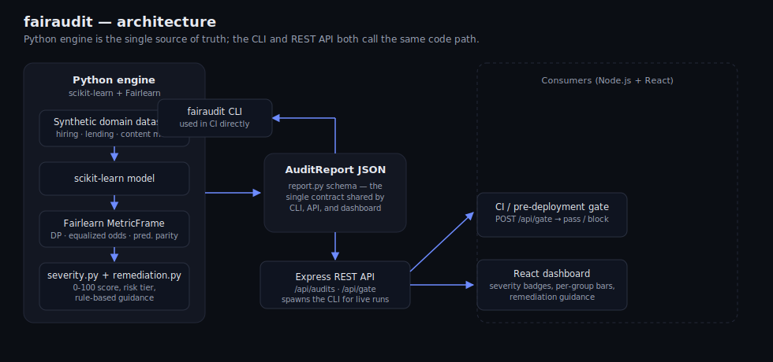

<div align="center">

# fairaudit

### Algorithmic Fairness Auditing Framework

**A model-agnostic ML auditing framework that computes demographic parity, equalized odds, and predictive parity across hiring, lending, and content-moderation models — surfacing bias before it ships, not after.**

Python · scikit-learn · Fairlearn · React · Node.js

</div>

---

## What this is

Most ML fairness incidents don't happen because no one cared — they happen because no one *checked*, or the check lived in a notebook that never ran again after the demo. `fairaudit` packages fairness auditing as infrastructure instead of a one-off analysis:

- **Model-agnostic core.** The auditor's entire contract is `y_true`, `y_pred`, `sensitive_features`. It never touches your model object, so it works identically whether predictions came from a scikit-learn pipeline, an XGBoost model, a rules engine, or a vendor API response.
- **Three fairness criteria, not one.** [Demographic parity](#the-three-criteria), [equalized odds](#the-three-criteria), and [predictive parity](#the-three-criteria) each catch different failure modes — a model can satisfy one while badly violating another.
- **Severity scoring, not just numbers.** Every metric difference is converted into a documented 0–100 severity score and a risk tier (negligible → critical), so "0.14" turns into "moderate, here's what to do about it" instead of requiring a fairness researcher to interpret it.
- **Rule-based remediation guidance.** Each finding comes with concrete next steps — named Fairlearn APIs (`ThresholdOptimizer`, `ExponentiatedGradient`, `Reweighing`) and specific things to check, not "reduce bias" platitudes.
- **A real pre-deployment quality gate.** `fairaudit gate` and `POST /api/gate` return a hard pass/fail plus which metric blocked it, so this can sit in CI the same way a test suite or a linter does.
- **Three consumption paths.** Library, CLI, or REST API — same underlying engine, so they can never silently drift out of sync with each other.



---

## The three criteria

| Criterion | Question it answers | Fails when… |
|---|---|---|
| **Demographic parity** | Are positive-outcome rates equal across groups, regardless of whether the outcome is warranted? | A hiring model hires 30% of one group and 17% of another, even at equal qualification levels. |
| **Equalized odds** | Conditional on the true outcome, are true-positive and false-positive rates equal across groups? | A lending model correctly approves qualified borrowers from one group far more often than an equally qualified borrower from another. |
| **Predictive parity** | Conditional on a positive prediction, is precision equal across groups? | A "flagged as risky" prediction means something different — is right less often — for one group than another. |

All three are computed via [Fairlearn's `MetricFrame`](https://fairlearn.org/), reported as the difference between the best- and worst-performing group (0 = parity, larger = more disparity). Demographic parity also reports the selection-rate *ratio*, checked against the EEOC's [four-fifths rule](https://www.eeoc.gov/laws/guidance/questions-and-answers-clarify-and-provide-a-common-interpretation-uniform-guidelines) (ratio < 0.8 is treated as evidence of adverse impact in U.S. hiring law) as an additional, commonly-cited reference point.

---

## Severity scoring

A 5-point demographic parity gap and a 35-point gap are not "the same problem, twice as bad" — small gaps are often noise, gaps past ~30 points are almost always real and actionable. Rather than one linear scaling constant, `severity.py` uses documented anchor points:

| Difference | Severity score | Risk tier |
|---|---|---|
| 0.00 | 0 | negligible |
| 0.05 | 20 | low |
| 0.10 | 40 | moderate |
| 0.20 | 70 | high |
| 0.30 | 90 | critical |
| 0.40+ | 100 | critical |

A report's **overall severity** is the *worst* of its three metric severities — one badly-failing criterion is enough to block a deployment, even if the other two look fine. By default, the pre-deployment gate blocks on any single metric scoring **≥ 70** ("high" or worse); override this per metric via `thresholds` in the CLI, the API, or `FairnessAuditor(gate_thresholds=...)`.

---

## Try it: sample output

The repo ships with real, pre-computed audit reports (`server/data/*.json`) for all three domains, generated by `engine/scripts/generate_reports.py`, so the dashboard and API have something to show immediately:

| Domain | Overall severity | Gate |
|---|---|---|
| Hiring | 60.8 (moderate) | ✅ pass |
| Lending | 54.5 (moderate) | ✅ pass |
| Content moderation | 72.0 (**high**) | ❌ **blocked** |

Content moderation's flagged finding, abbreviated:

```json
{
  "domain": "content_moderation",
  "metrics": [
    {
      "metric_name": "demographic_parity",
      "difference": 0.21,
      "ratio": 0.7762,
      "by_group": { "group_a": 0.938, "group_b": 0.728 },
      "worst_group": "group_b",
      "severity_score": 72.0,
      "severity_tier": "high",
      "passes_four_fifths_rule": false,
      "remediation": [
        "Should block deployment until addressed. Recommended remediation:",
        "Audit the training labels for group_b: a selection-rate gap this size often means the historical decisions used as labels were biased, not just the features.",
        "Try Fairlearn's `Reweighing`-style sample weighting or `CorrelationRemover`...",
        "Consider Fairlearn's `ThresholdOptimizer` to set group-specific decision thresholds..."
      ]
    }
  ],
  "overall_severity_score": 72.0,
  "overall_severity_tier": "high",
  "gate_pass": false
}
```

This isn't a contrived example — the synthetic content-moderation dataset bakes in a proxy feature (an upstream "dialect classifier score") modeled on real, published findings that automated toxicity classifiers over-flag certain dialects/writing styles ([Sap et al., 2019](https://aclanthology.org/D19-1163/)), *without* the downstream model ever seeing group membership directly. That's the exact failure mode fairness audits exist to catch: bias reproduced through a legitimate-looking correlated feature, not an obviously discriminatory input.

---

## Running locally

### 1. Python engine

```bash
cd engine
pip install -r requirements.txt
pip install -e .          # installs the `fairaudit` CLI

# audit one domain
fairaudit audit --domain hiring

# audit all three and write JSON reports
fairaudit audit-all --output-dir reports/

# regenerate the seed data committed in server/data/
python scripts/generate_reports.py

# run the test suite
pytest
```

### 2. REST API

```bash
cd server
cp .env.example .env
npm install
npm start        # http://localhost:4000
```

```bash
curl http://localhost:4000/api/audits
curl http://localhost:4000/api/audits/hiring
curl -X POST http://localhost:4000/api/audits/hiring/run     # live re-audit
curl -X POST http://localhost:4000/api/gate \
  -H "Content-Type: application/json" \
  -d '{"domain": "content_moderation", "thresholds": {"demographic_parity": 80}}'
```

`POST /api/gate` also accepts an inline `report` instead of a `domain`, so any CI job that can produce an `AuditReport`-shaped JSON — from this framework or your own pipeline — can hit the gate without this server needing to know anything about your model.

### 3. Dashboard

```bash
cd dashboard
npm install
npm run dev       # http://localhost:5173, proxies /api to the server above
```

---

## Repository layout

```
engine/                  Python package (the source of truth)
  fairaudit/
    datasets.py           synthetic hiring / lending / content-moderation datasets
    models.py              trains each domain's "production-style" scikit-learn model
    metrics.py             demographic parity, equalized odds, predictive parity (Fairlearn)
    severity.py            metric difference -> 0-100 score + risk tier
    remediation.py         rule-based, Fairlearn-specific remediation guidance
    auditor.py              FairnessAuditor — the model-agnostic entry point
    gate.py                 pre-deployment pass/fail logic
    report.py               shared JSON report schema
    cli.py                  `fairaudit` command-line interface
  scripts/generate_reports.py
  tests/

server/                  Node.js + Express REST API
  src/routes/audits.js    GET /api/audits, GET /api/audits/:domain, POST /api/audits/:domain/run
  src/routes/gate.js       POST /api/gate
  src/pythonBridge.js       spawns the CLI for live audit runs
  data/                     committed seed reports (demo mode)

dashboard/               React + Vite dashboard
  src/components/          severity badges, per-group metric bars, remediation panels

docs/architecture.svg
```

---

## Design notes

**Why severity scores instead of raw metric diffs?** Raw fairness metrics are hard to act on without domain expertise — "0.14 equalized odds difference" doesn't tell an engineer whether to page someone. A documented, versioned scoring policy turns that into "moderate — track it" vs. "high — this blocks the release," which is the actual decision a team needs to make.

**Why bake proxy features into the synthetic data instead of just biasing the label?** "Fairness through unawareness" — simply not feeding a model the sensitive attribute — famously does not work when other features correlate with it. Each synthetic domain includes one such proxy (professional network access in hiring, a zip-code wealth index in lending, an upstream dialect-classifier score in content moderation) so the demo models reproduce a real disparity even without ever seeing group membership, which is the actual mechanism that makes fairness auditing necessary in production.

**Why is the sensitive attribute always `group_a` / `group_b`?** The framework is intentionally agnostic to what the protected characteristic *is* — swap in a real column (gender, race, age band, disability status, etc.) and everything else works unchanged. Abstracting it in the demo data avoids embedding assumptions about any specific real-world population while still exercising the exact same code path.

---

## License

MIT
